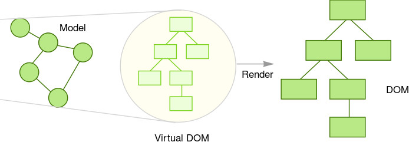
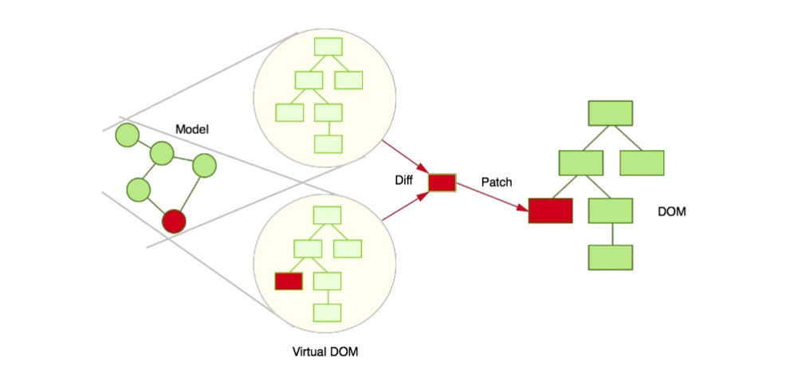

# React.js

#### Roksolana Fedkovych

---

# What is React.js?
---

# Why was React developed?

-- --

### Why was React developed?

* Complexity of Facebook's UI architecture
* Complexity of two-way data binding
* Bad UX from using "cascading updates" of DOM tree
* A lot of data on a page changing over time

---


# Sites Using React

-- --


https://github.com/facebook/react/wiki/Sites-Using-React

---

# Configuration

-- --

## Own configuration

* `package.json` - dependencies
* `webpack.config.js` - config for transpiling js and jsx


-- --

## Create React App
* `$ create-react-app my-app`

* `$ cd my-app`

* `$ npm start`

---

# Virtual DOM

-- --

## Virtual DOM

A virtual DOM object has the same properties as a real DOM object, but it lacks the real thing's power to directly change what's on the screen.

Manipulating the DOM is slow. Manipulating the virtual DOM is much faster, because nothing gets drawn onscreen. Think of manipulating the virtual DOM as editing a blueprint, as opposed to moving rooms in an actual house.

-- --

## Projecting Data



-- --

## Projecting Data



---

# What is JSX

-- --

## What is JSX

JSX is an XML/HTML-like syntax used by React that extends ECMAScript so that XML/HTML-like text can co-exist with JavaScript/React code. The syntax is intended to be used by preprocessors (i.e., transpilers like Babel) to transform HTML-like text found in JavaScript files into standard JavaScript objects that a JavaScript engine will parse

-- --

## Syntax

```jsx
const element = </img>;
```

```jsx
const element = ;
```

-- --

-- --

## JSX/JavaScript code

```jsx
const nav = (
  <ul id="nav">
    <li><a href="#" className="home">Home</a></li>
    <li><a href="#" className="about">About</a></li>
    <li><a href="#" className="contact_us">Contact Us</a></li>
  </ul>
);

```
-- --

## Babel will transform it into

```jsx
let nav = React.createElement(
  "ul",
  { id: "nav" },
  React.createElement("li", null,
    React.createElement(
       "a", { href: "#" },
       "Home"
    )
  ),
  React.createElement("li", null,
    React.createElement(
       "a", { href: "#" },
       "About"
    )
  ),
  React.createElement("li", null,
    React.createElement(
       "a", { href: "#" },
       "Contact Us"
    )
   )
);
```

---

# Component

-- --

## Component

Components are self-contained reusable building blocks of web application.
React components are basically just idempotent functions (same input produces same output).

They describe your UI at any point in time, just like a server-rendered app.

-- -- 

### Functional component

```jsx
function Welcome(props) {
  return <h1>Hello, {props.name}</h1>;
}
```

-- --

### Class component

```jsx
class Welcome extends React.Component {
  render() {
    return <h1>Hello, {this.props.name}</h1>;
  }
}

```

-- --

### Rendering a component

```jsx
const element = <Welcome name="Yoda" />;

ReactDOM.render(
  element,
  document.getElementById('root')
);
```

-- --

### Composing Components

```jsx
function App() {
  return (
    <div>
      <Welcome name="Vader" />
      <Welcome name="Luke" />
      <Welcome name="Leia" />
    </div>
  );
}

ReactDOM.render(
  <App />,
  document.getElementById('root')
);
```

---

# Props & State

---

# Props

-- --

## Props are Read-Only

```jsx
function Avatar(props) {
  return (
    
  );
}

...

function Comment(props) {
  return (
    <div className="comment">
      <div className="user-info">
        <Avatar 
          src={this.props.author.image.src}
          alt={this.props.author.fullName}
        />
      </div>
  ....


```

---

# State

-- --

## State

```jsx
class Clock extends React.Component {
  constructor(props) {
    super(props);
    this.state = {date: new Date()};
  }

  tick() {
    this.setState({
      date: new Date()
    });
  }

  render() {
    return (...);
  }
}

```

---

# Lifecycle

-- --

## Mounting

* `constructor()`
* `componentWillMount()`
* `render()`
* `componentDidMount()`

-- --

## Updating

* `componentWillReceiveProps(nextProps)`
* `shouldComponentUpdate(nextProps, nextState)`
* `componentWillUpdate(nextProps, nextState)`
* `render()`
* `componentDidUpdate(prevProps, prevState)`

-- --

## Unmounting

* `componentWillUnmount()`

-- --

## `render()`

* React elements 
* String and numbers
* Portals
* null
* Booleans.

-- --
## [Understanding the React Component Lifecycle](http://busypeoples.github.io/post/react-component-lifecycle/)

---


# Thinking in React

-- --

### Start With A Mock


```javascript
// JSON API returns:
[
  {category: "Sporting Goods", price: "$49.99", stocked: true, name: "Football"},
  {category: "Sporting Goods", price: "$9.99", stocked: true, name: "Baseball"},
  {category: "Sporting Goods", price: "$29.99", stocked: false, name: "Basketball"},
  {category: "Electronics", price: "$99.99", stocked: true, name: "iPod Touch"},
  {category: "Electronics", price: "$399.99", stocked: false, name: "iPhone 5"},
  {category: "Electronics", price: "$199.99", stocked: true, name: "Nexus 7"}
];
```

-- --

### Step 1: Break The UI Into A Component Hierarchy


```
* FilterableProductTable
  * SearchBar

  * ProductTable
    * ProductCategoryRow
    * ProductRow
```

-- --

### Step 2: Build A Static Version in React

-- --

### Step 3: Identify The Minimal (but complete) Representation Of UI State

-- --

### Step 4: Identify Where Your State Should Live

-- --

### Step 5: Add Inverse Data Flow

-- --

### And That’s It


---

# [*Calculator*](https://ahfarmer.github.io/calculator/)

-- --

+ components
  + App.js
  + Display.js
  + ButtonPanel.js
  + Button.js

-- --

### App.js

```jsx
import React from 'react';
import Display from './Display';
import ButtonPanel from './ButtonPanel';
import calculate from '../logic/calculate';

class App extends React.Component {
  constructor(props) {
    super(props);
    this.state = {
      total: null,
      next: null,
      operation: null,
    };
  }

  handleClick = (buttonName) => {
    this.setState(calculate(this.state, buttonName));
  }

  // ...
```

-- --

### App.js

```jsx
  // ...

  render() {
    return (
      <div className="component-app">
        <Display
          value={this.state.next || this.state.total || '0'}
        />
        <ButtonPanel
          clickHandler={this.handleClick}
        />
      </div>
    );
  }
}
export default App;
```

-- --

### ButtonPanel.js

```jsx
class ButtonPanel extends React.Component {
  handleClick = (buttonName) => {
    this.props.clickHandler(buttonName);
  }

  render() {
    return (
      <div className="component-button-panel">
        <div>
          <Button name="AC" clickHandler={this.handleClick} />
          <Button name="+/-" clickHandler={this.handleClick} />
          <Button name="%" clickHandler={this.handleClick} />
          <Button name="÷" clickHandler={this.handleClick} orange />
        </div>
        <div>
          <Button name="7" clickHandler={this.handleClick} />
          <Button name="8" clickHandler={this.handleClick} />
          <Button name="9" clickHandler={this.handleClick} />
          <Button name="x" clickHandler={this.handleClick} orange />
        </div>
        // ...
      </div>
    );
  }
}
export default ButtonPanel;
```

-- --

### Button.js

```jsx
import React from 'react';

class Button extends React.Component {
  handleClick = () => {
    this.props.clickHandler(this.props.name);
  }

  render() {
    const className = [
      "component-button",
      this.props.orange ? "orange" : "",
      this.props.wide ? "wide" : "",
    ];

    return (
      <div className={className.join(" ").trim()}>
        <button onClick={this.handleClick}>
          {this.props.name}
        </button>
      </div>
    );
  }
}
export default Button;
```

-- --

### Display.js

```jsx
import React from 'react';

class Display extends React.Component {
  render() {
    return (
      <div className="component-display">
        <div>
          {this.props.value}
        </div>
      </div>
    );
  }
}
export default Display;
```

---

# Server-Side React Rendering

---

# Thanks!
